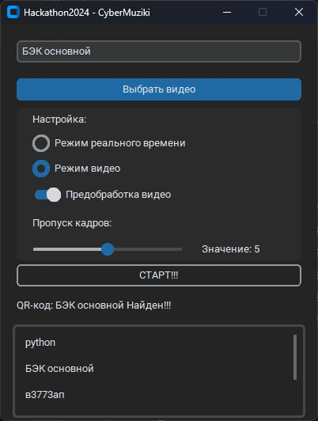
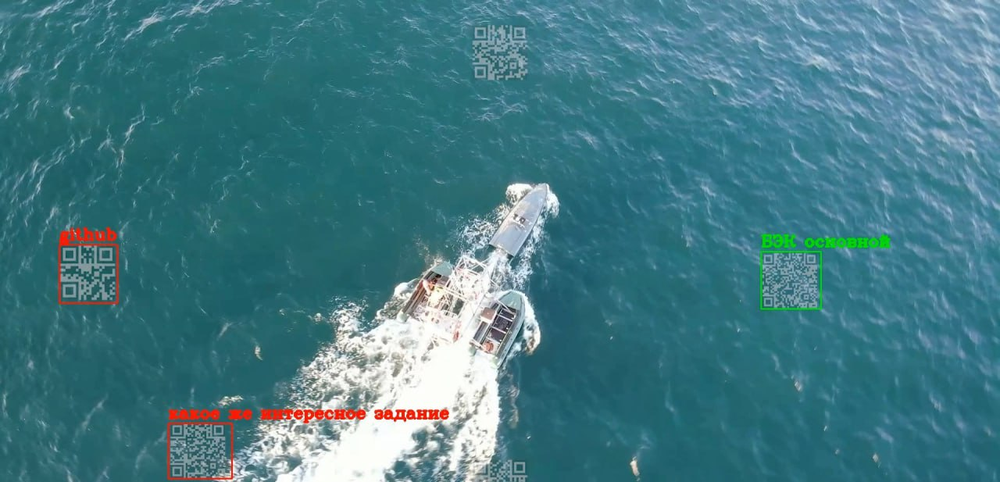

# QR_CYBERMUZIKI-HACK- 🚀

## Hakatone 2024 Task: Detecting QR-Codes On Video (AI) 🤖

### Техническое задание: Определение нужного QR-кода 🎯

#### Цель

Разработать систему для распознавания нужного QR-кода среди различных QR-кодов на видео, валидации остальных и сохранения их в файл. 🕵️‍♀️

#### Шаги выполнения

1.  **Сбор данных:** 📁
    *   Имеется видео с различными QR-кодами. 📹
    *   Необходимо найти определенный QR-код (целевой). 🔍
    *   Все остальные QR-коды необходимо валидировать и сохранить в файл. 📝

2.  **Выбор инструментов:** 🛠️
    *   `qreader` - для распознавания QR-кодов на изображении. 🖼️
    *   `OpenCV` - для отображения видео в реальном времени, разбиения его на кадры и отрисовки границ QR-кодов прямоугольниками. 📐

3.  **Предобработка изображения:** ⚙️
    *   Разбить видео на кадры. 🎞️
    *   Применить предобработку (преобразование в оттенки серого, фильтрация шума) для улучшения качества распознавания. 🎨

4.  **Распознавание QR-кодов:** 👀
    *   Использовать `qreader` для распознавания QR-кодов на кадрах. ✅
    *   Определить местоположение каждого QR-кода. 📍
    *   Отобразить границы найденных QR-кодов с помощью прямоугольников (OpenCV). ▭

5.  **Сравнение данных:** 📊
    *   Сравнить извлеченные данные с заранее определенным содержимым целевого QR-кода. ↔️
    *   Отметить совпадающий QR-код как "нужный". 👍

6.  **Вывод результата:** 📤
    *   Вывести информацию о найденном целевом QR-коде (содержимое, позиция). ℹ️
    *   Валидировать и сохранить остальные QR-коды в файл. 💾
    *   Вывести сообщение, если целевой QR-код не найден. ⚠️
#### Интерфейс 

#### Работа пограммы 

#### Почему выбрали QReader и Python, а не другие библиотеки и среду? 🤔

В данной задаче использование `QReader` обусловлено его **способностью работать с искаженными QR-кодами.** 💪 Он показал отличные результаты в тестах с кодами, которые:

*   Расположены под углом. 📐
*   Имеют другой цвет. 🌈
*   Имеют малый размер. 🤏
*   Являются прозрачными. 👻
*   Имеют другие виды искажений. 🌀

В отличие от Qreader, OPENcv и PyzBar они не могут определить коды в данных состояниях

Ниже вы можете увидеть почему мы выбрали именно его.

## Benchmark

&nbsp; &nbsp; &nbsp; &nbsp; &nbsp; &nbsp; &nbsp; &nbsp; &nbsp; &nbsp; &nbsp; &nbsp; &nbsp; &nbsp; &nbsp;  

  
| Библиотека  | Максимальная величина наклона  |
|-------------|-----------------------|
|    Pyzbar   |           17º         |
|    OpenCV   |           46º         |
|    QReader  |           79º         |
  

